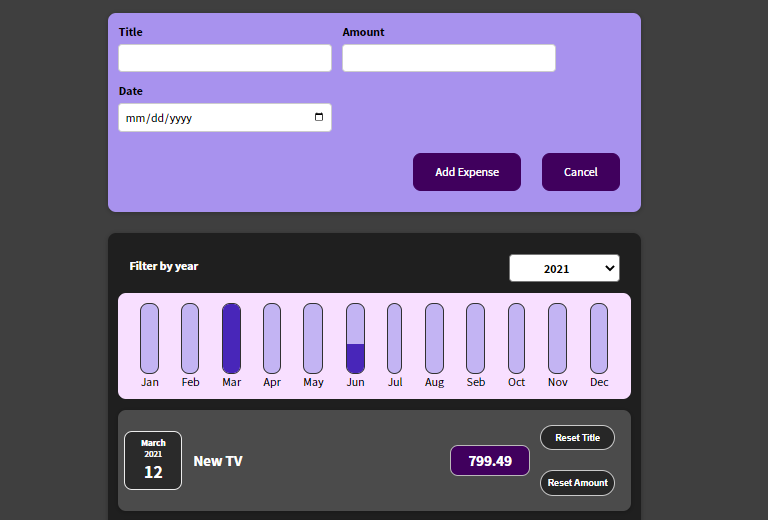
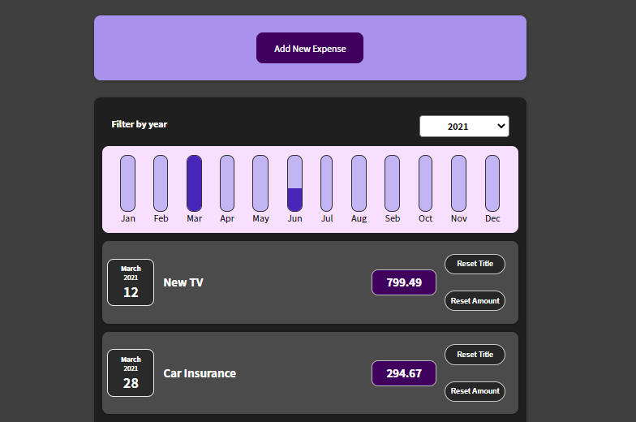

# Expenses Application

## Introduction

This app is one of Maximilian's course apps, this is an assignment project,
It allows you to add users and render their information on the screen.

## Overview

- 
- 


## Teck Stack

- HTML
- CSS
- JavaScript
  - Reactjs


## Installation

install all required modules

```
npm install
```
Run the app in the development mode.

```
npm start
```

Open [http://localhost:3000](http://localhost:3000) to view it in your browser.


